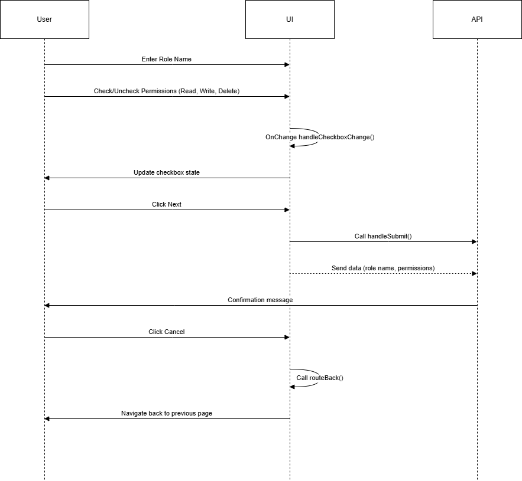

## Role Creation Feature
This  includes a role creation form that collects user input for role name, assigns permissions via checkboxes for read, write, delete actions, and submits the data to an API. The user can either proceed by clicking "Next" or cancel the operation, which navigates them back to the previous page.

### Features
Input field for Role Name.
Checkboxes for assigning permissions (Read, Write, Delete).
State management for checkbox changes.
Submit functionality to send data to the API.
Cancel button to navigate back to the previous page.

### Functions
`handleCheckboxChange`: Handles the change in the checkbox selection (Read, Write, Delete).

`handleSubmit`: Submits the form data to the API when the user clicks "Next".

`routeBack`: Navigates back to the previous page when the user clicks "Cancel".

```http
Method:POST
````
#### Input
```http
"roledata": {
        "name" : "jhkjab",
        "permission" :{" employee": [3, 2], "department": [2] },
        "type": "standard"
    }

```

### Headers
`Access-Token`

`Referesh-Token`

### Body

Pass the `orgid` in the body

### Flow Chart
