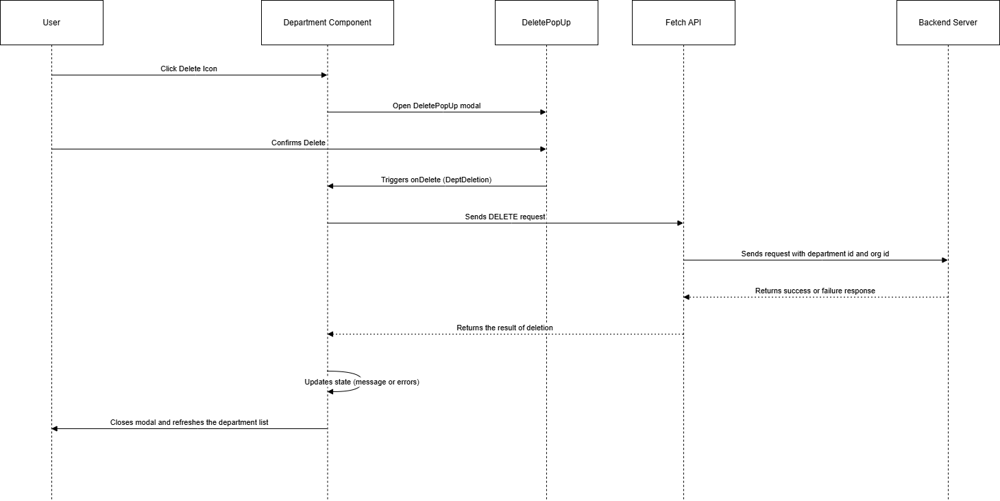

## Department Deletion - API Documentation


### Overview
 The delete method in this feature allows the user to remove a department from the system by selecting it from a list of departments. Once the delete operation is triggered, a confirmation popup appears, and upon confirming, the department is deleted from the database.

### Frontend Process
#### Triggering the Delete Popup:

A delete icon (trash icon) is provided in the department list.
When a user clicks on the delete icon for a particular department, a modal popup (DeletePopUp) appears, asking for confirmation before deletion.

#### Delete Functionality:

 If the user confirms the deletion, the `DeptDeletion` function is triggered to send a `DELETE` request to the backend to remove the department.
The department ID and organization ID (`orgId`) are passed in the request payload.

### Key Frontend Components:
#### DeletePopUp Component:

Displays a confirmation modal to the user.
Has two actions: `Delete` and `Cancel`. Clicking `Delete` will call the API to remove the department; clicking "Cancel" will close the modal without making any changes.

#### Icon Trigger:

`<i className="bi bi-trash delete-icon">`: Clicking this icon sets the department ID to be deleted and opens the `DeletePopUp` modal.

#### Backend Process
The DeptDeletion function sends a DELETE request to the backend API to remove the department.

#### API Endpoint
```http
DELETE /department
```

### Request Headers
#### Access-Token:
 Authentication token for the current session.
#### Refresh-Token: 
Token to refresh access in case the session has expired.
Content-Type: application/json

### Sequence diagram
