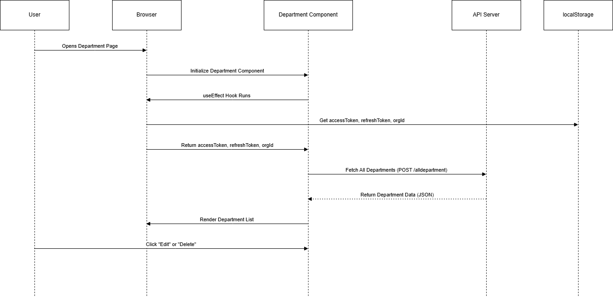

## Department Component
The `Department` component fetches and displays a list of departments from an API.

### Features
#### Fetch Department Data: 
Fetches department details from a backend API using the organization ID and authentication tokens.
#### Display Department List:
 Displays a list of departments in a table format.
#### Edit and Delete Options: 
Includes Edit and Delete buttons for each department.
### Requirements
#### Next.js
#### API Endpoint: 
This component requires a backend API that returns a list of departments for a given organization.
#### LocalStorage: 
The component expects access tokens (`accessToken`), refresh tokens (`refreshToken`), and organization ID (`orgId`) to be stored in the user's localStorage.

### Code Explanation
1. #### useEffect Hook
The component uses the `useEffect` hook to fetch department data when the component first renders. It calls the `fetchData` function, which makes a `POST` request to the API with the stored tokens and organization ID.

2. #### fetchData Function
The `fetchData` function:

Retrieves the `accessToken`, `refreshToken`, and `orgId` from localStorage.
Sends a `POST` request to the API endpoint `${process.env.NEXT_PUBLIC_API_URL}/alldepartment`.
Handles the response and updates the component’s state with the department list.

3. #### Table Display
The fetched departments are displayed in a table:

#### Department Name: 
Displayed in the first column.
#### Edit and Delete Buttons: 
Each row has two buttons for potential `Edit` and `Delete` functionality.

### Flow Diagram
