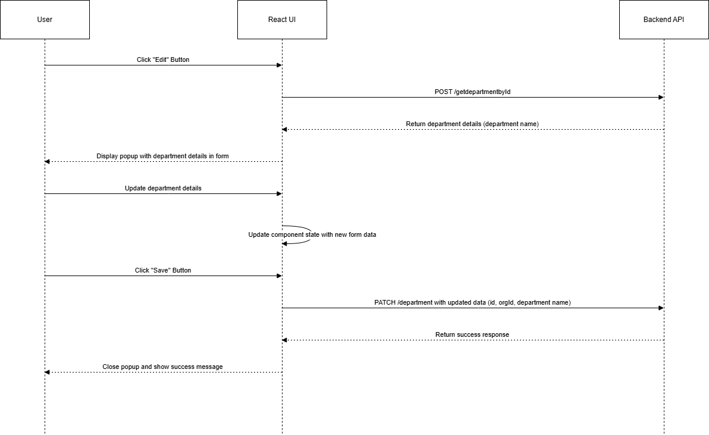

# Details

```http
  PATCH / department
```
### Method
```http
  POST /getdepartmentbyid
```
```http
  Button -> Edit icon near corresponding department
```
It will display a popup form with the selected data in the field.

And we will change the existing data and click save button.

| Parameter     | Type     | Description         |
| :------------ | :------- | :------------------ |
| `Department Name` | `string` | Reqired.string      |


#### Input

```json
{
  "department id":"4c4006d0-5008-41e1-81fe-536f6ed69b83",
  "org id":"469006d0-5008-41e1-81fe-536f6ed69b83"
 
}
``` 

```http
  when clicking save button it will send the data to the backend
```

#### Working 

```javascript
  In department page POST the indidual department id through API and fill the default values of the input with response and on further edit of data flows according to create department and PATCH method is used to rerwite on the database
```

#### Method

```javascript
  PATCH : department
```
### Headers

We are passing the access token and refresh token in headers get from the local storage.

### body

We are passing the orgId,and deparment id with input data in the body to specify the organization

```javascript
 It return response from the API
```
```javascript
Department has been updated successfully
```


### Flow chart


