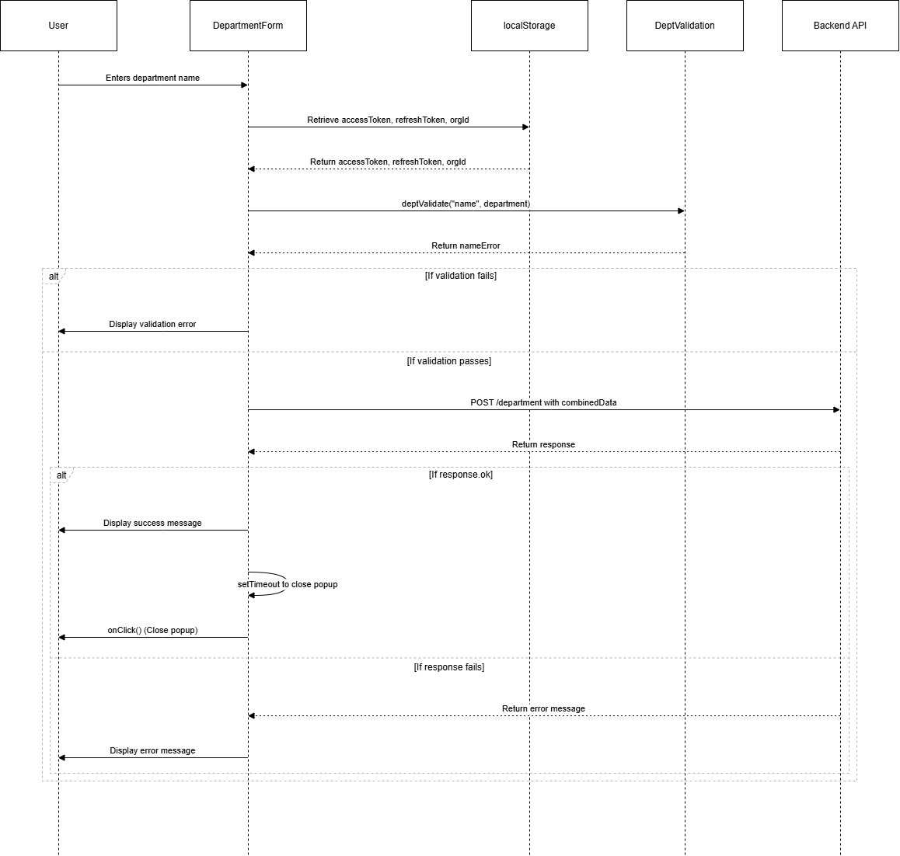

### DepartmentForm 
The `DepartmentForm` component allows users to input and submit department information. It handles form validation, submission to an API endpoint, and manages the local state for department data.

### Features
#### Form Submission: 
Captures department name input and submits it to a backend API.
#### Validation:
 Uses the deptValidate function to validate the department name.
#### Error Handling: 
Displays error messages for invalid inputs and failed submissions.
State Management: Manages input and form submission state using React’s useState hook.
#### LocalStorage Integration:
 Fetches accessToken, refreshToken, and orgId from localStorage to include in the API request headers.
#### Popup Handling:
 Provides an option to close the popup via a closePopUp function.
### Dependencies
React (with hooks like `useState` for state management)
`deptValidate` function for input validation

### Validation
The department name is validated using the deptValidate function.
If the name is invalid, an error message will be displayed below the input field.
### Form Submission
The form sends a POST request to `${process.env.NEXT_PUBLIC_API_URL}/department` with the department name and organization ID (`orgId`) retrieved from `localStorage`.

Headers for the request include `Access-Token` and `Refresh-Token` from `localStorage`.

### Buttons
Save: Submits the form and triggers the API call.

Close: Closes the popup (triggers the `onClick` function).

### Flow Diagram

