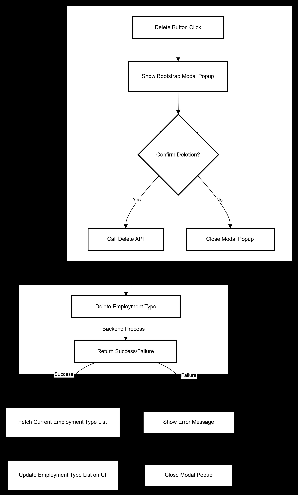

# Details

```http
DELETE/employmenttype
```

```
when we clicking the delete Employment type it will enable a pop-up for surety of deletion and on confirmation we can delete the department based on the id 
```
#### Method
```http
DELETE/employmenttype
```
### Headers
```http
Access-Token : token
```
 
```http
Refresh-Token : token
```

#### Body
```http
 "orgid":orgid,
```
```http
 "id":employmenttype id
```


#### data from the API

```json
 {

    "message": "Employment Type Deleted Successfully"

}
``` 


### Flow chart


