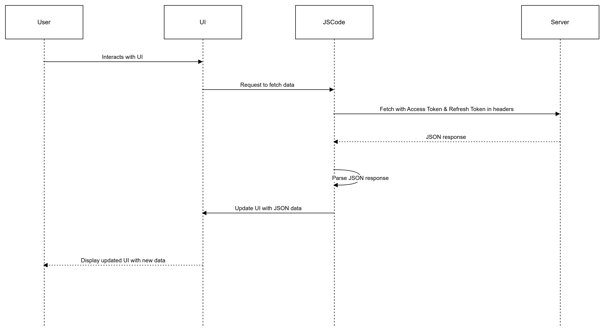

# Details

```http
POST/getallemploymenttype
```
```http
Navigation : manage -> Employment type
```
```
when we clicking the Employment type it will navigate to the Employment type page and display the types
```
#### Method
```http
POST/getallemploymenttype
```
### Headers
```http
Access-Token : token
```
 
```http
Refresh-Token : token
```

#### Body
```http
  orgid : id
```


#### data from the API

```json
 [
    {
        "id": "f331760d-68d2-4616-b045-6fe79abf328c",
        "userid": "",
        "orgid": "",
        "type": "Permananent",
        "createdby": "",
        "createddate": ""
    }
]
``` 


##### Output

| Type      | edit | delete |
| :-------- | ---- | ------ |
| permanent | icon | icon   |


### Flow chart


