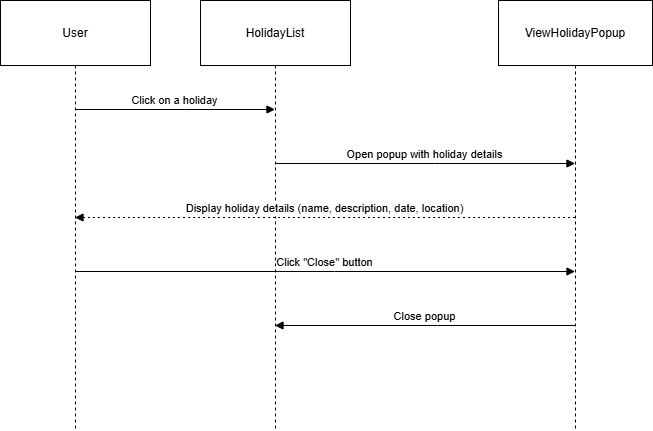

## View Holiday

##### The `ViewHoliday` component is used to display detailed information about a holiday in a popup. It retrieves the holiday details from an API and renders the data, including the holiday's name, description, date, location, and whether the holiday is mandatory or optional. The component also provides a close button to dismiss the popup.

### Features
Fetches holiday details from an API using the provided holiday ID.

Displays the holiday's name, description, date (formatted), location, and mandatory status.

Renders a "Close" button to close the popup.
## Usage
### How It Works
1.The `ViewHoliday` component is invoked when a user clicks on a holiday in the holiday list.

2.The component makes an API request using the holiday ID to fetch full holiday details.

3.Once the data is fetched, the component displays the holiday details inside a popup.

4.The popup contains a Close button that, when clicked, closes the popup.

### Props
The component accepts the following props:

### id:
 A string representing the ID of the selected holiday. This is used to fetch holiday details.
### onClose: 
A callback function that is triggered when the close button is clicked, closing the popup.

### Component Details
### API Integration: 
The viewDetails function is responsible for making an API call to retrieve the holiday details based on the provided holiday id.
### Popup Display: 
The holiday details (name, description, date, location, and mandatory status) are displayed in a popup once the data is fetched successfully.
### Close Button: 
The "Close" button triggers the onClose prop function to close the popup when clicked.

### Flow chart

