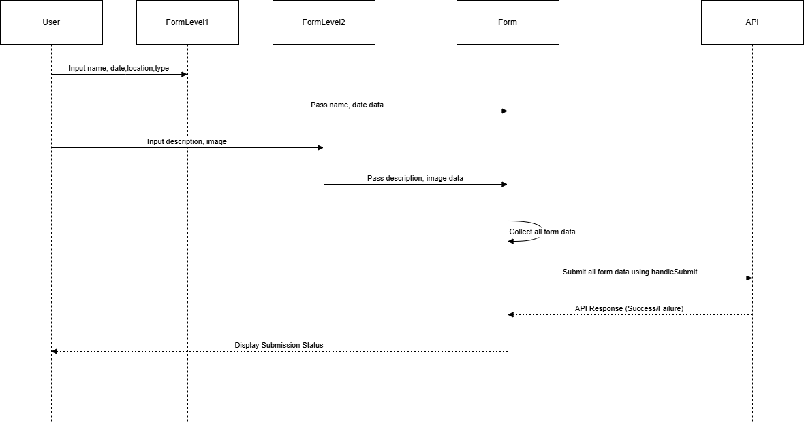

# Details

```http
  POST/Holiday
  
```
```http
  Button->Add Holiday
```
```http
  Form1
```

| Parameter | Type     | Description                |
| :-------- | :------- | :------------------------- |
| `HolidayName` | `string` | Reqired.string |
| `Date` | `Date`| Required.Valid date |
| `Location` | `string`| Required.string |

#### Input

```json
  {
  "HolidayName" : "Pongal",
  "Date" : "2024-09-09",  
  "Location":"North-India","South-India"
}
``` 

```http
  when clicking next button it navigate next form
```

```http
  Form2
```

| Parameter | Type     | Description                |
| :-------- | :------- | :------------------------- |
| `Description` | `string` | Reqired.string |
| `Image` | `file`| Required.Valid Image |


#### Input

```json
  {
  "Description" : "Pongal Day",
  "image" : "pongal.png",  
  }
``` 

```http
  When clicking button save it pass the data to the holiday page
```
#### Method


```javascript
  In holiday page it can get the data from the Form1 and Form2 and pass the data into the API
```

#### Method

```javascript
  POST:-holiday
```
### Headers
We are passsing the access token and refresh token in headers get from the login.

### body
We are passing the orgid with input data in the body to specify the organization

```javascript
 It return response from the API
```
```javascript
Holiday has been created successfully
```


### Flow chart




