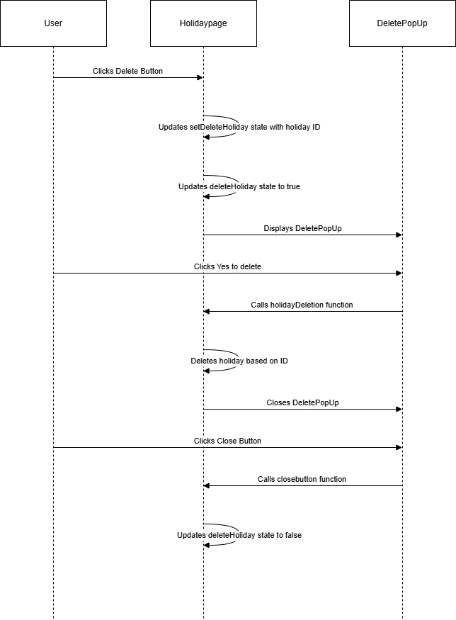

# Delete Holiday
## Endpoint
```
DELETE /Holiday
```
### Description
This endpoint allows the user to delete a holiday entry by its unique identifier. Upon initiating the deletion, a confirmation popup is displayed to ensure the user intends to proceed with the deletion.

### Request
 ##### Method:  `DELETE`
URL: `/Holiday/{id}`
#### Path Parameters
id (string): The unique identifier of the holiday to be deleted.
#### Button Functionality
Button: `Delete`
     
######  When clicked, a confirmation popup is displayed with the following options:
`Yes`: Proceed with deletion.

`No`: Cancel the deletion.

#### Confirmation Popup


Message: Are you sure you want to delete ?

Buttons:

`Yes`: Calls the holidayDeletion() function.

`No`:  Closes the popup without making any changes.

#### Functionality

#### 1.On Clicking "Delete" Button:
A confirmation popup is triggered.

#### 2.On Clicking "Yes" in the Popup:

The `holidayDeletion(id)` function is called.

The function sends a `DELETE` request to the `/Holiday/{id}` endpoint.

If the deletion is successful:

Close the confirmation popup.

### Flow chart


