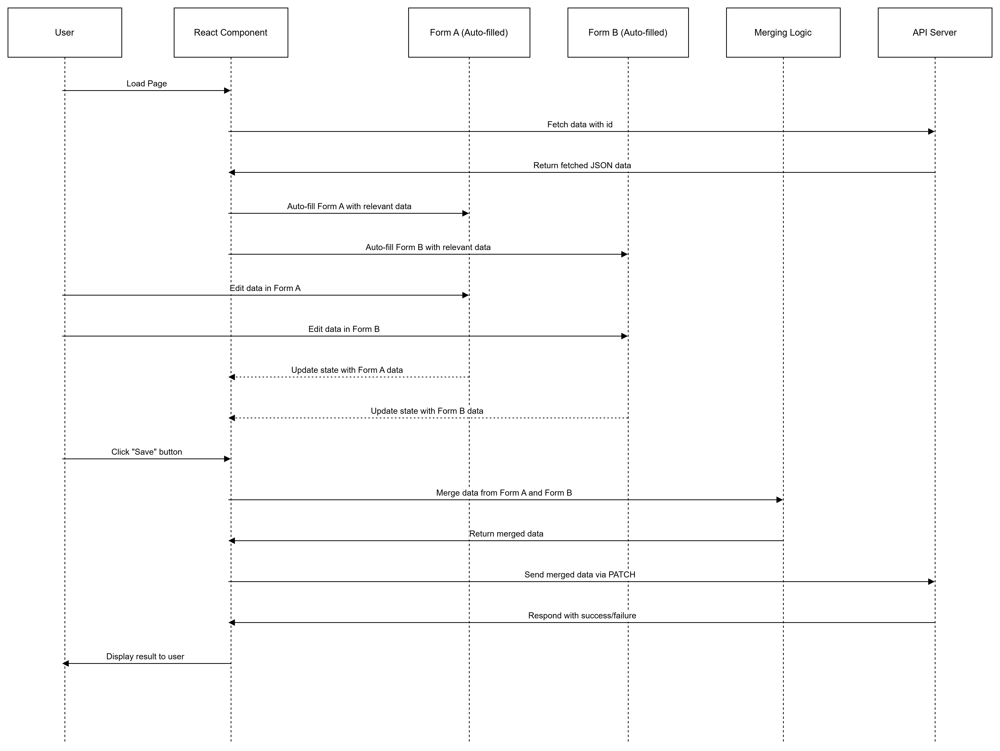

# Details

```http
  PATCH / Holiday
```
```http
  POST / Holiday
```
```http
  Button -> Edit icon near corresponding holiday
```
```http
  Form Level1
```

| Parameter     | Type     | Description         |
| :------------ | :------- | :------------------ |
| `HolidayName` | `string` | Reqired.string      |
| `Date`        | `Date`   | Required.Valid date |
| `Location`    | `string` | Required.string     |

#### Input

```json
{
  "HolidayName" : "Pongal",
  "Date" : "2024-09-09",  
  "Location":"North-India, South-India"
}
``` 

```http
  when clicking next button it navigate next form
```

```http
  Form Level2
```

| Parameter | Type     | Description                |
| :-------- | :------- | :------------------------- |
| `Description` | `string` | Reqired.string |
| `Image` | `file`| Required.Valid Image |


#### Input

```json
  {
  "Description" : "Pongal Day",
  }
``` 

```http
  When clicking button save it pass the data to the holiday page
```
#### Working 

```javascript
  In holiday page POST the indidual holiday id through API and fill the default values of the input with response and on further edit of data flows according to create holiday and PATCH method is used to rerwite on the database
```

#### Method

```javascript
  PATCH : holiday
```
### Headers

We are passing the access token and refresh token in headers get from the local storage.

### body

We are passing the orgId with input data in the body to specify the organization

```javascript
 It return response from the API
```
```javascript
Holiday has been updated successfully
```


### Flow chart


