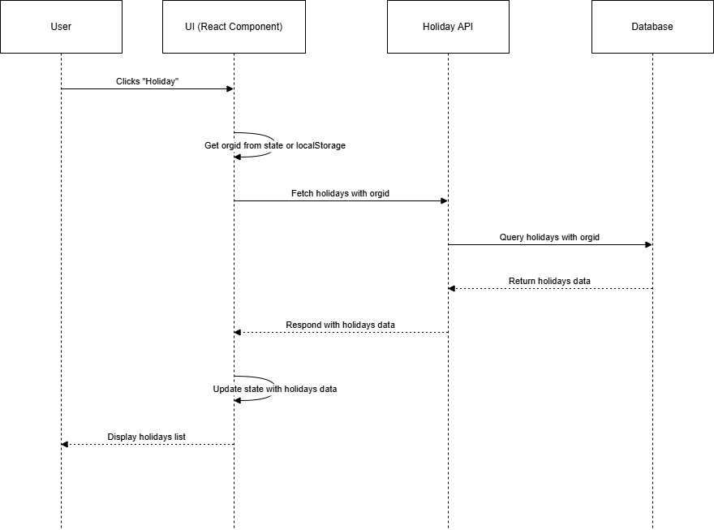

# Details

```http
  GET/Holiday
  
```
```http
  Button->Holiday
```
```
when we clicking the Holiday Button it will navigate to the Holiday page and display the holidays
```
#### Method
```http
   POST/Holiday
```
### Headers
#### Yet to be updated
#####
#### Pass the orgid in the body
```http
  body:JSON.stringify({orgid})
```
```http
 Fetch data from the API
```


#### data from the API

```json
  [
    {
        "userid": "",
        "orgid": "f57ce828-631f-466b-a0ca-b26969412f26",
        "id": "90ea39e0-afd8-4956-a0b5-aad83ded923a",
        "name": "Pongall",
        "description": "Pongal",
        "date": "2024-03-23T00:00:00Z",
        "mandatory": false,
        "applicablefor": {
            "location": "All over India"
        },
        "createdby": "",
        "createddate": ""
    }
]
``` 
####Output

| Name | Description     | Date                |Type|
| :-------- | :------- | :------------------------- |:---------|
| `Pongal | `Pongal Holiday` | 2024-01-15 |Mandatory|


### Flow chart




