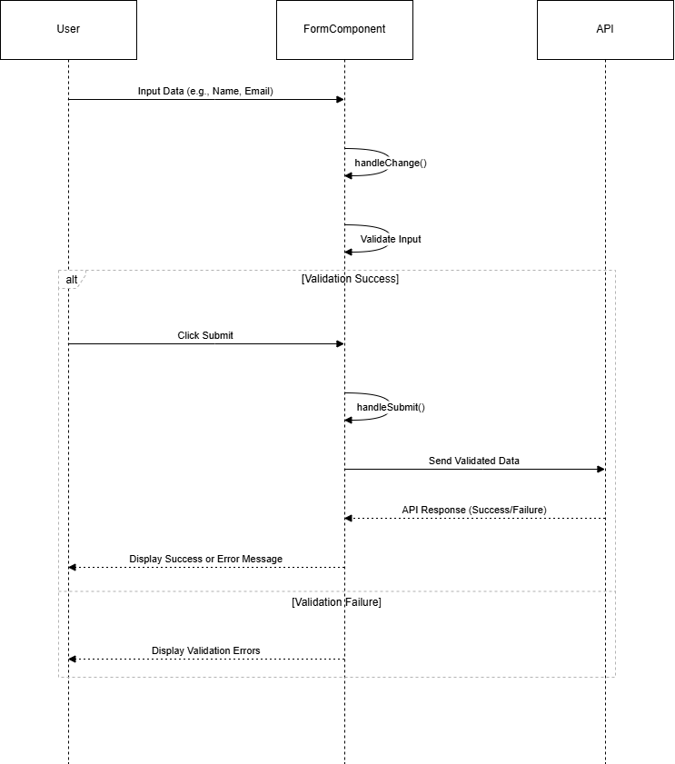

# Details

```http
  POST/SignUp
```

| Parameter      | Type     | Description                 |
| :------------- | :------- | :-------------------------- |
| `Firstname`    | `string` | Required.String/Numeric     |
| `emailaddress` | `string` | Reqired.Valid Email address |
| `password`     | `string` | Required.String             |
| `Location`     | `string` | Required.String             |

#### Method

```javascript
POST: -signup;
```

#### A Few things to remember

#### Validation

#### Input

```json
{
  "Firstname": "vishali",
  "emailaddress": "vishlai.v@atomedgesoft.com",
  "password": "********",
  "Location": "Asia/Calcutta"
}
```

### Flow chart

<<<<<<<< HEAD:nextt/Documentation/signup/signUp .md

========
